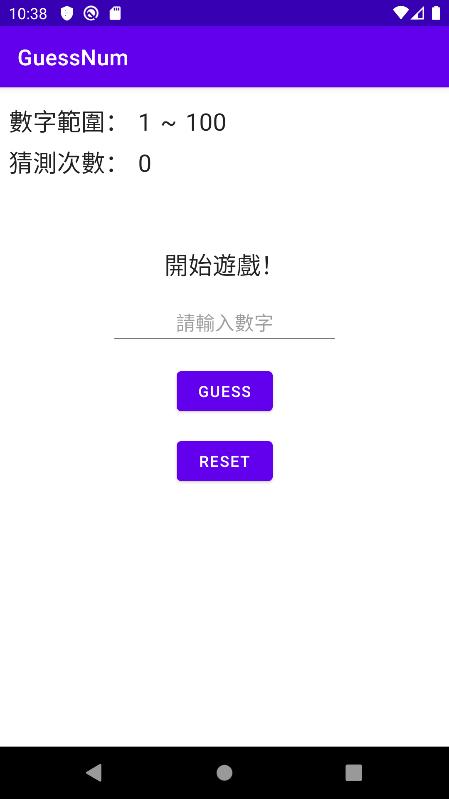
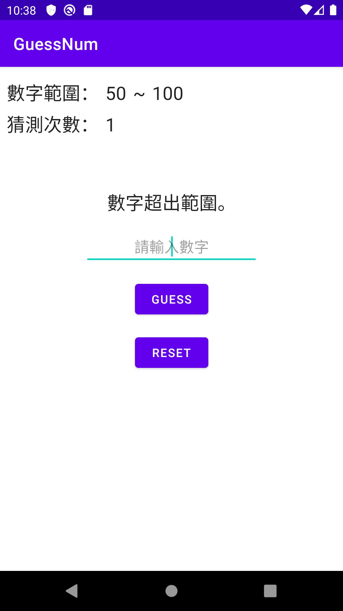
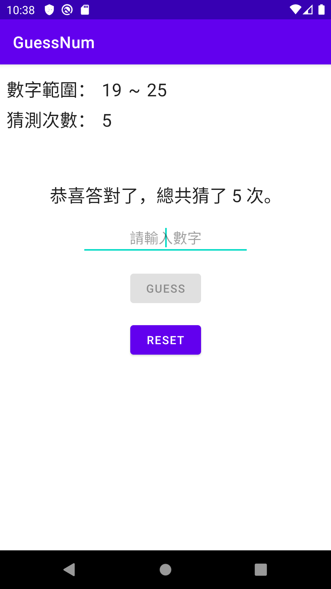

# Practices_Android_GuessNum
Practices：GuessNum

***
#### 項目 ####
Mvvm GuessNum
---

#### 簡介 ####

本專案將對簡易版本的「猜數字遊戲」重構，從「MVC」架構改為「MVVM」架構的練習，並導入「LiveCycle（LiveData、VideoModel）」、「DataBinding」。

<br>

```
Practiecs! Without unceasing practice nothing can be done.
```

<br>

#### 預覽圖 ####




